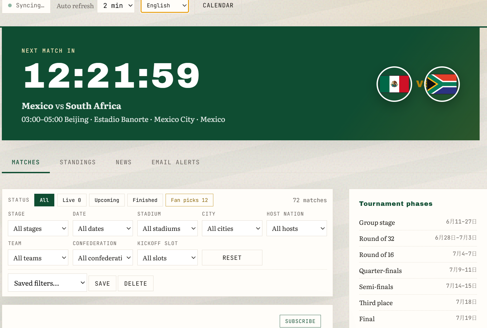
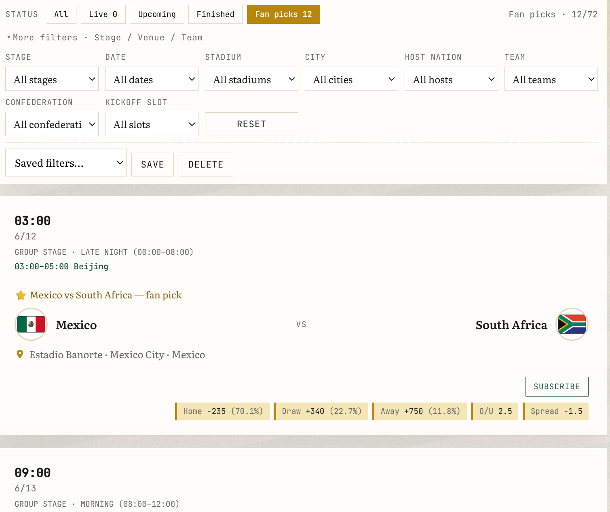
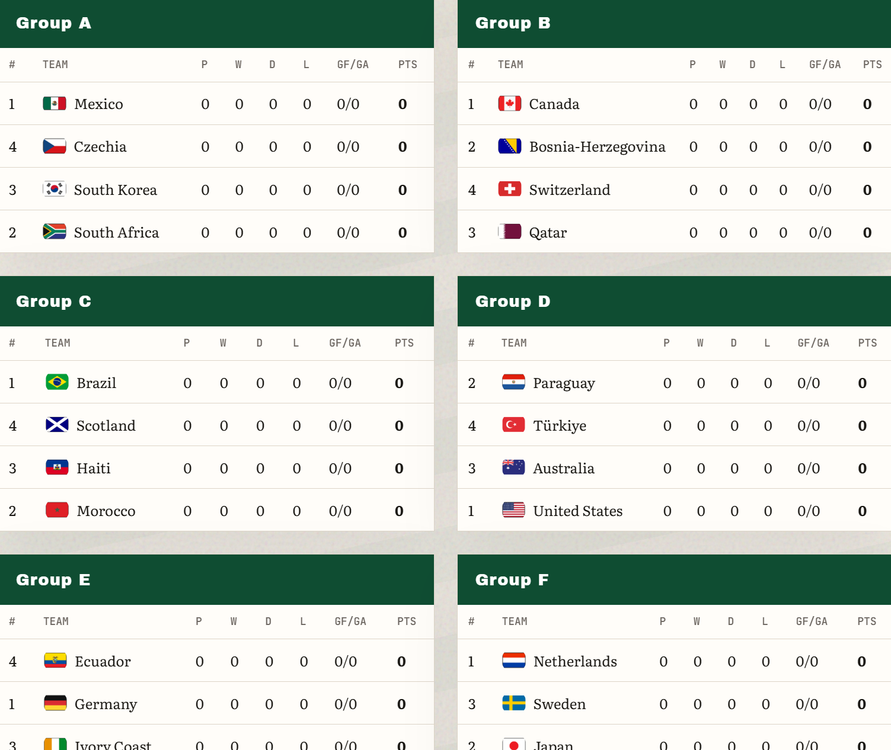

# World Cup 2026 Match Center / 世界杯观赛指挥台


-orange)

[](https://angela-letter.github.io/world-cup-2026-dashboard/)

A fan-built dashboard for the **2026 FIFA World Cup** (USA · Canada · Mexico). Live schedule, odds, standings, news, calendar export (.ics), and optional email alerts — in **8 UI languages** with **timezone selector** (UTC offsets, defaults follow language).

**Live demo (read-only):** https://angela-letter.github.io/world-cup-2026-dashboard/  
**Full version (local):** email alerts, calendar export, live ESPN refresh — run FastAPI below.

> **Disclaimer:** Unofficial project. Data from ESPN public endpoints. Not affiliated with FIFA. Odds are for reference only — not betting advice.

## Languages | 语言

- [English](#english) · [中文](#中文) · [日本語](#日本語) · [Español](#español) · [Português](#português) · [Deutsch](#deutsch) · [Français](#français) · [한국어](#한국어)

## Screenshots



| Fan picks & match cards | Group standings |
|-------------------------|-----------------|
|  |  |

## Quick start

```bash
git clone https://github.com/Angela-letter/world-cup-2026-dashboard.git
cd world-cup-2026-dashboard
pip install -r requirements.txt
cp .env.example .env          # optional — email alerts only
cp notify_config.example.json notify_config.json
python -m uvicorn server:app --host 127.0.0.1 --port 8765
```

Open **http://127.0.0.1:8765** — use the language and timezone selectors in the header (timezone defaults follow language; pick any UTC offset manually).

### GitHub Pages demo

Push to `master` triggers [`.github/workflows/pages.yml`](.github/workflows/pages.yml): exports ESPN snapshot → builds `docs/` → deploys static site. Demo hides email/subscribe/calendar; data refreshes on each deploy.

### Email alerts (optional)

- **Sender:** QQ Mail SMTP (`QQ_EMAIL_ACCOUNT`, `QQ_EMAIL_AUTH_CODE` in `.env`)
- **Recipient:** **any valid email** (Gmail, Outlook, Yahoo, 163, QQ, etc.)
- Alerts are **off by default** in this demo repo. No credentials are committed.

### Privacy

- No user tracking. Subscription settings stay in local `notify_config.json`.
- Do not commit `.env` or real email addresses.

---

## English

**World Cup 2026 Match Center** helps fans follow all 48 teams across North America.

**Features**

- Match schedule with Beijing kickoff times and 2-hour windows
- Filters: stage, date, stadium, city, host nation, team, confederation, time slot
- Fan-pick highlights and per-match viewing tips
- Live odds (ESPN / DraftKings), group standings, news
- Export to Apple / Google / Outlook calendar (.ics)
- UI in 8 languages (header language selector)
- Optional email: pre-match, score changes, full-time, digest

**Stack:** Python · FastAPI · vanilla JS · ESPN API

---

## 中文

**2026 世界杯观赛指挥台** — 面向全球球迷的美加墨世界杯赛程页。

**功能**

- 赛程卡片：北京时间开球 + 2 小时区间（如 03:00–05:00）
- 多维度筛选、新球迷推荐场次、每场观赛提示
- 赔率、积分榜、资讯
- 日历导出（.ics）
- 页头切换 8 种界面语言
- 可选邮件推送：发件走 QQ SMTP，**收件可为任意邮箱**

**隐私：** 本仓库为演示用途，不含真实邮箱或授权码；订阅配置仅存本地。

---

## 日本語

**2026 FIFAワールドカップ試合センター** — 48チームの日程・オッズ・順位表を一覧。

- 北京時間のキックオフと試合時間帯
- 8言語UI、カレンダー出力、任意のメール通知
- 非公式ファンプロジェクト（ESPNデータ）

---

## Español

**Centro de partidos Mundial 2026** — calendario, cuotas, clasificación y noticias.

- Horarios (hora de Pekín) y ventanas de partido
- Interfaz en 8 idiomas, exportación .ics
- Alertas por correo opcionales (SMTP QQ → cualquier bandeja)

---

## Português

**Central da Copa 2026** — jogos, odds, classificação e notícias.

- Horários e filtros avançados
- 8 idiomas na interface, calendário .ics
- E-mail opcional (envio QQ SMTP, destino qualquer)

---

## Deutsch

**WM 2026 Spielzentrale** — Spielplan, Quoten, Tabelle, News.

- Peking-Anstoßzeiten, 8 Sprachen, Kalenderexport
- Optionale E-Mail-Benachrichtigungen

---

## Français

**Centre matchs Coupe du monde 2026** — calendrier, cotes, classement, actus.

- Fuseau Pékin, 8 langues, export calendrier
- Alertes e-mail optionnelles

---

## 한국어

**2026 월드컵 경기 센터** — 48개국 일정, 배당, 순위, 뉴스.

- 베이징 킥오프 시간 및 8개 언어 UI
- 선택적 이메일 알림 (QQ SMTP 발송, 수신은 모든 메일 가능)

---

## Project structure

```
world-cup-dashboard/
├── server.py              # FastAPI + ESPN aggregation
├── i18n.py                # Chinese data labels (teams, venues)
├── match_tips.py          # Per-match viewing tips
├── calendar_export.py     # .ics generation
├── static/
│   ├── index.html
│   ├── css/style.css
│   └── js/
│       ├── i18n.js        # 8-language UI strings
│       └── app.js
└── docs/screenshots/
```

## License

MIT — see [LICENSE](LICENSE).
